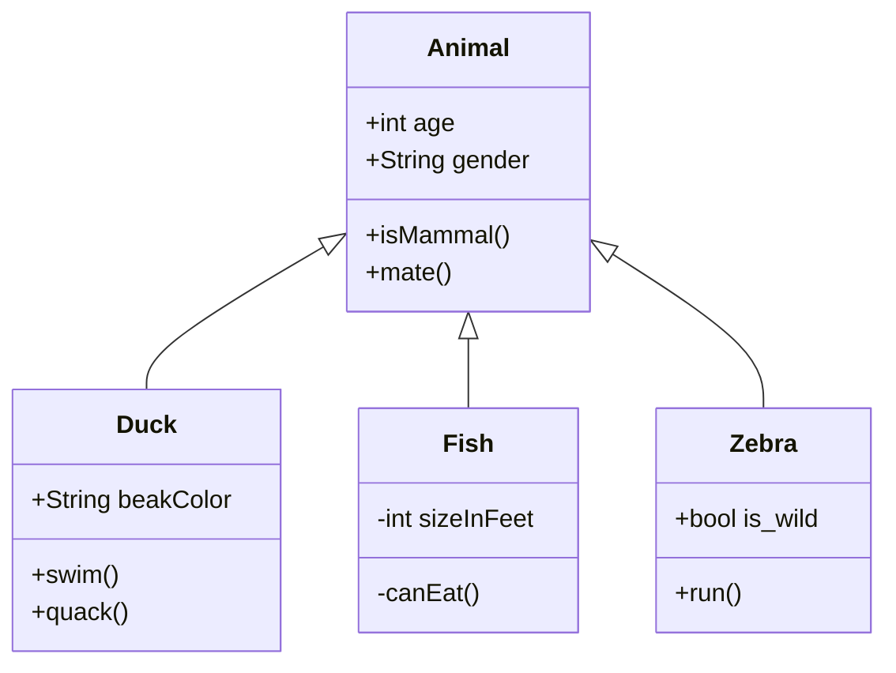
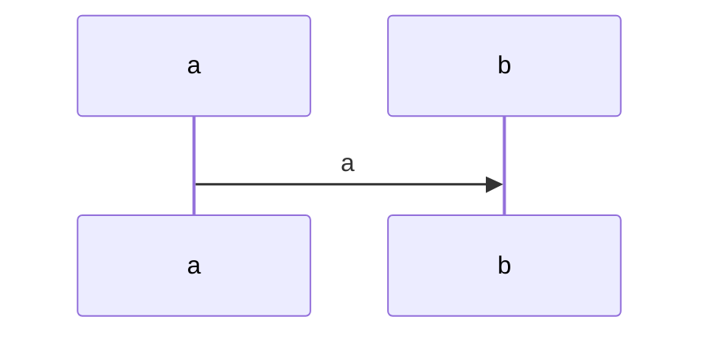

# programming_formalism_intro

Main course page is found here: https://uppsala.instructure.com/courses/69215

Topics

  - Day1 Intro https://uppmax.github.io/programming_formalism_intro/index.html
  - Day2 Algorithms+data structures
  - Day3-4 Paradigms: design patterns, modular code
  - Day4 Test-driven Development, testing
  - Day5 Optimization

