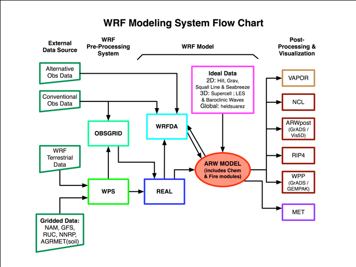

# The modularity of WRF weather model


## WRF (ARW) source code github

Look at file tree for a feeling of modules. <https://github.com/wrf-model/WRF>

- Interesting directories related to the Fortran codes:
    - dyn_em/
    - phys/

- Below is some module dependencies in the physics section of the code


*Source: <https://opensky.ucar.edu/islandora/object/opensky:2898>*

## The WRF suite with flow chart



WPS (preprocessing) programs to be run every simulation

- ungrib.exe
- metgrid.exe

WRF programs to be run every simulation

- real.exe
- wrf.exe

## Personal workflow script of different parts

### Workflow consisting of several bash scripts. 

```mermaid
flowchart LR
    A["Download global weather data"] --> Preprocess --> Real (initialization) -->  WRF (simulation) --> Analysis
```

1. **download script**

    - download large-scale weather data

1. **script_WPS** (Preprocessing)

   - find dates/times to be used
   
   - find downloaded files

   - start **run_ungrib.sh**
      - insert correct dates into a "namelist"
      - run **ungrib.exe** (_Fortran_)
      
    - start **run_metgrid.sh**
      - insert correct dates into a "namelist"
      - run **metgrid.exe** (_Fortran_)

   - start next script **script_WRF**
   
1. **script_WRF**

   - find output from the last script
   
   - run ./run_real.sh
      - insert correct dates into a "namelist"
      - run **real.exe** (_Fortran_)

   - run ./run_wrf.sh
      - insert correct dates into a "namelist"
      - run **wrf.exe** (_Fortran_)

   - run ./analysis_script.sh
      - inserts correct time
      - runs a _python_ script that plots some graphs


