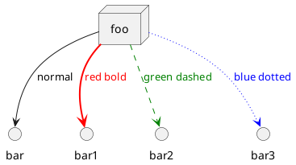

# The modularity

WPS (preprocessing) programs to be run every simulation
- ungrib.exe
- metgrid.exe
- 
WRF programs to be run every simulation
- real.exe
- wrf.exe

## Automatise this!

1. **download script**

1. **script_WPS**

   - find dates/times to be used
   
   - find downloaded files

   - start **run_ungrib.sh**
      - insert correct dates into a "namelist"
      - run **ungrib.exe**
      
    - start **run_metgrid.sh**
      - insert correct dates into a "namelist"
      - run **metgrid.exe**

   - start next script **script_WRF**
   
1. **scipt_WRF**

   - find output from the last script
   
   - run ./run_real.sh
      - insert correct dates into a "namelist"
      - run **real.exe**

   - run ./run_wrf.sh
      - insert correct dates into a "namelist"
      - run **wrf.exe**

   - run ./analysis_script.sh
     

